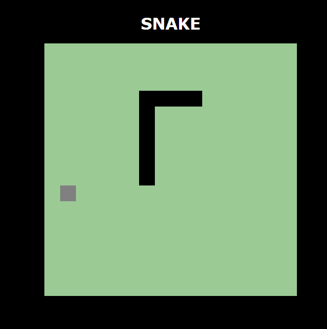

# JogoDaCobrinha feito em Javascript
Jogo da cobrinha realizado em mini-curso da plataforma Dio.me  
link: https://thanaracs.github.io/JogoDaCobrinha-JS/

Use as setinhas para se mover ou se preferir, utilize as teclas a,w,s e d  
 ou 

